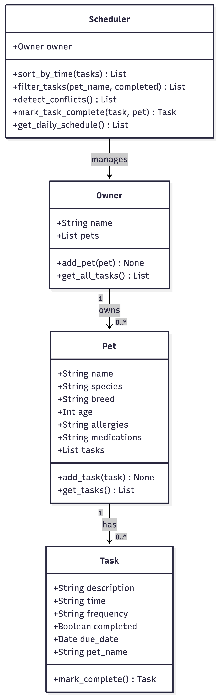

# PawPal+ (Module 2 Project)

You are building **PawPal+**, a Streamlit app that helps a pet owner plan care tasks for their pet.

## Scenario

A busy pet owner needs help staying consistent with pet care. They want an assistant that can:

- Track pet care tasks (walks, feeding, meds, enrichment, grooming, etc.)
- Consider constraints (time available, priority, owner preferences)
- Produce a daily plan and explain why it chose that plan

Your job is to design the system first (UML), then implement the logic in Python, then connect it to the Streamlit UI.

## What you will build

Your final app should:

- Let a user enter basic owner + pet info
- Let a user add/edit tasks (duration + priority at minimum)
- Generate a daily schedule/plan based on constraints and priorities
- Display the plan clearly (and ideally explain the reasoning)
- Include tests for the most important scheduling behaviors

## Getting started

### Setup

```bash
python -m venv .venv
source .venv/bin/activate  # Windows: .venv\Scripts\activate
pip install -r requirements.txt
```

### Suggested workflow

1. Read the scenario carefully and identify requirements and edge cases.
2. Draft a UML diagram (classes, attributes, methods, relationships).
3. Convert UML into Python class stubs (no logic yet).
4. Implement scheduling logic in small increments.
5. Add tests to verify key behaviors.
6. Connect your logic to the Streamlit UI in `app.py`.
7. Refine UML so it matches what you actually built.

## 🖥️ Sample Output

Paste a sample of your app's CLI or Streamlit output here so a reader can see what a generated plan looks like:

```
=============================================
  PawPal+ | Today's Schedule for Jessie
=============================================
  [    ]  08:00  |  Biscuit   |  Morning feeding
  [    ]  08:00  |  Mochi     |  Morning feeding
  [    ]  09:00  |  Mochi     |  Give allergy pill
  [    ]  10:00  |  Biscuit   |  Vet appointment
  [    ]  15:00  |  Mochi     |  Playtime
  [    ]  18:00  |  Biscuit   |  Evening walk

--- Conflict Check ---
  WARNING: Conflict at 08:00: 'Morning feeding' and 'Morning feeding'

--- Biscuit's Tasks Only ---
  18:00  |  Evening walk  (daily)
  08:00  |  Morning feeding  (daily)
  10:00  |  Vet appointment  (once)

--- Marking 'Evening walk' complete ---
  Done! Biscuit now has 4 tasks (tomorrow's walk auto-scheduled).
  
```

## 🧪 Testing PawPal+
Sorting Correctness — test_sort_by_time_returns_chronological_order
Adds three tasks in reverse time order (18:00, 12:00, 08:00) and verifies that Scheduler.sort_by_time() returns them earliest-first.

Recurrence Logic — test_daily_recurrence_creates_next_day_task
Marks a daily task complete and confirms that a new task is automatically created with a due date of exactly tomorrow.

Conflict Detection — test_detect_conflicts_flags_duplicate_times
Schedules two tasks at the same time slot and verifies that Scheduler.detect_conflicts() returns at least one warning.

Task Completion — test_mark_complete_changes_status
Calls mark_complete() on a one-time task and confirms its completed flag flips to True.

Task Addition — test_add_task_increases_pet_task_count
Adds a task to a Pet and confirms the pet's task list grows from 0 to 1.


```bash
# Run the full test suite:
python -m pytest

# Run with coverage:
pytest --cov
```

Sample test output:

```
====================================================================== test session starts ======================================================================
platform darwin -- Python 3.13.7, pytest-9.1.1, pluggy-1.6.0
rootdir: /Users/jessiegadson/Documents/Baruch_College_Classes/CodePath/ai110-module2show-pawpal-starter
plugins: anyio-4.14.0
collected 5 items                                                                                                                                               

tests/test_pawpal.py .....                                                                                                                                [100%]

======================================================================= 5 passed in 0.02s =======================================================================


```

**Confidence Level: 3/5** - All 5 tests pass and the three core behaviors (sorting, recurrence, conflict detection) are verified. Score is not higher because the suite is small and edge cases like double-completing a task or unknown frequencies are not yet tested.

## ✨ Features

- **Chronological sorting** — Tasks are always displayed earliest to latest using parsed HH:MM time values, so the schedule is never out of order regardless of the order tasks were added.
- **Conflict warnings** — The scheduler scans all tasks and flags any time slot where two or more tasks overlap, surfacing a warning before the owner acts on a broken schedule.
- **Daily & weekly recurrence** — Marking a recurring task complete automatically creates the next occurrence with the correct due date, so the owner never has to re-enter it.
- **Pet & status filtering** — Tasks can be filtered by pet name, completion status, or both in a single pass, making it easy to focus on one pet or see what's still pending.
- **Today's schedule view** — Pulls only tasks due today (or with no due date) that are still pending, sorted by time, giving the owner a clean daily action list.

## 📐 Smarter Scheduling

| Feature | Method(s) | Notes |
|---|---|---|
| Task sorting | `Scheduler.sort_by_time()` | Sorts tasks chronologically using parsed HH:MM time values so single-digit hours sort correctly |
| Filtering | `Scheduler.filter_tasks()` | Filters tasks by pet name and/or completion status in a single pass over all tasks |
| Conflict handling | `Scheduler.detect_conflicts()` | Flags every time slot where two or more tasks are scheduled at the same time and returns a warning string |
| Recurring tasks | `Task.mark_complete()`, `Scheduler.mark_task_complete()` | Marking a daily or weekly task complete automatically creates the next occurrence with the correct due date |

## 📸 Demo Walkthrough

### UI Features
PawPal+ is a Streamlit app with a sidebar and three tabs:
- **Sidebar** — Enter your name and add pets (name, species, breed, age, allergies, medications)
- **Add Task tab** — Pick a pet, describe the task, set a time, and choose once / daily / weekly
- **Today's Schedule tab** — See task counts, conflict warnings, and a sorted schedule table for today
- **Manage Tasks tab** — Filter tasks by pet or status, and mark individual tasks complete

### Example Workflow
1. Open the app and enter your name in the sidebar
2. Add a pet — e.g. "Biscuit" (dog) and "Mochi" (cat)
3. Schedule tasks for each pet with different times and frequencies
4. Navigate to **Today's Schedule** — tasks appear sorted earliest to latest
5. If two tasks share a time slot, a yellow `⚠️ Conflict` warning appears above the table
6. Go to **Manage Tasks**, filter by pet, and click **✓ Done** on a daily task — it auto-schedules for tomorrow

### Key Scheduler Behaviors
- Tasks added in any order are always displayed chronologically (`Scheduler.sort_by_time()`)
- Scheduling two pets at the same time triggers a conflict warning (`Scheduler.detect_conflicts()`)
- Completing a daily or weekly task creates the next occurrence automatically (`Scheduler.mark_task_complete()`)
- Filtering by pet or status uses a single pass over all tasks (`Scheduler.filter_tasks()`)

### Sample CLI Output
```
=============================================
  PawPal+ | Today's Schedule for Jessie
=============================================
  [    ]  08:00  |  Biscuit   |  Morning feeding
  [    ]  08:00  |  Mochi     |  Morning feeding
  [    ]  09:00  |  Mochi     |  Give allergy pill
  [    ]  10:00  |  Biscuit   |  Vet appointment
  [    ]  15:00  |  Mochi     |  Playtime
  [    ]  18:00  |  Biscuit   |  Evening walk

--- Conflict Check ---
  WARNING: Conflict at 08:00: 'Morning feeding', 'Morning feeding'

--- Biscuit's Tasks Only ---
  18:00  |  Evening walk  (daily)
  08:00  |  Morning feeding  (daily)
  10:00  |  Vet appointment  (once)

--- Marking 'Evening walk' complete ---
  Done! Biscuit now has 4 tasks (tomorrow's walk auto-scheduled).
```
**Screenshot or video** *(optional)*: 




